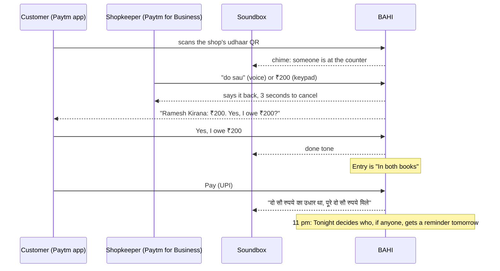
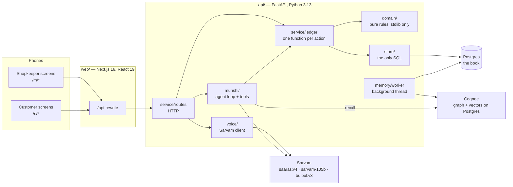
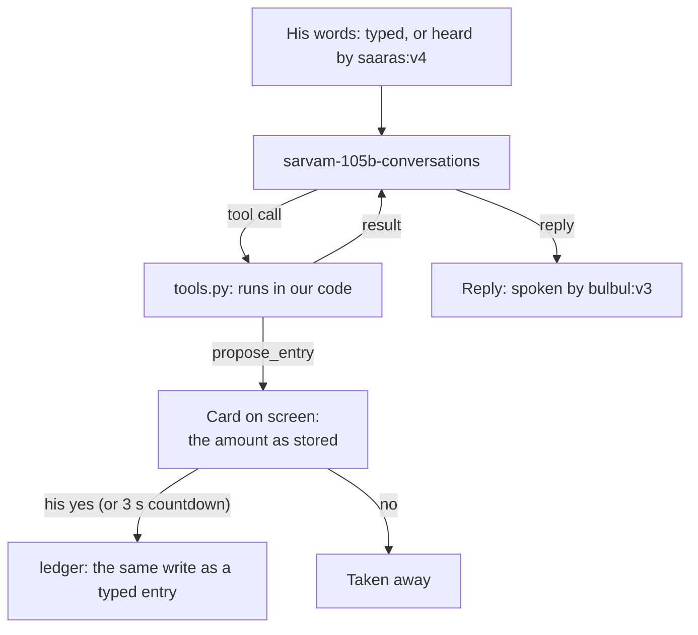

# BAHI — the udhaar book both sides can see

At the counter, the customer scans the shop's **udhaar QR**, a separate code
beside the pay QR. The shopkeeper's Soundbox chimes, and he says the amount
("do sau") or types it. The customer confirms it on the phone already in his
hand, sees what he owes across every shop, and clears it in one tap. Every night
an agent works out, per person, when a reminder should go, and far more often,
when it should not.

Built for the **Paytm Build for India AI Hackathon, Mumbai, 3 October 2026**,
Track 2 (AI-Powered Financial Journeys). BAHI is designed as screens inside
apps both people already have: **Paytm for Business** for the shopkeeper, the
**Paytm consumer app** for the customer, and the **Paytm Soundbox** on the
counter.

---

## Contents

1. [The problem](#the-problem)
2. [What BAHI does](#what-bahi-does)
3. [The rules the code keeps](#the-rules-the-code-keeps)
4. [Architecture](#architecture)
5. [How each part works](#how-each-part-works)
6. [The data model](#the-data-model)
7. [The API](#the-api)
8. [The screens](#the-screens)
9. [Testing and evaluation](#testing-and-evaluation)
10. [Running it](#running-it)
11. [Deploying it](#deploying-it)
12. [Layout](#layout)

---

## The problem

India's kirana shops run on udhaar: goods now, money later. The credit book by
the till is written by one person, held by one person and read by one person.
The other party to every entry has no copy.

- **The shopkeeper** can't tell who is about to pay from who is drifting away,
  so he treats everyone the same: he either chases everyone or no one.
- **The customer** can't see his own total, has no proof if the number is wrong,
  and gets asked for money in front of other customers.

Ledger apps digitised the shopkeeper's half. The customer still gets an SMS with
a number he can't check.

## What BAHI does

One book, two sides, both always looking at the same entries.



The main flows:

- **Scan to confirm.** The customer scans, the shopkeeper says or types the
  amount, the customer taps "Yes, I owe ₹200". Several people can wait at the
  counter at once. BAHI never guesses which of them an amount is for.
- **The munshi.** An AI bookkeeper the shopkeeper talks or types to, in Hindi,
  English or a mix: "बी विंग में जो रहते हैं उनके नाम दो सौ लिख दो". It finds the
  customer in the real book, asks when it is unsure, and puts a card on screen.
  Only the shopkeeper's yes writes the entry.
- **Paytm Assistant.** The same munshi on a page of its own (`/m/assistant`), for
  asking rather than writing: who pays this week, someone's account, tomorrow's
  reminders, or how something in the app works. Anything it writes is still a card
  that waits for his yes. The conversation carries on between visits; New chat
  starts another.
- **Chat and disputes.** One thread per shop and customer. Each udhaar appears as a
  live card with its state on a badge (waiting, agreed, part paid, paid), and each
  payment as its own card with Paytm's green tick. The customer answers Yes,
  **Not mine** or **Wrong amount**, and the shopkeeper takes the entry back or
  corrects it with a new entry the customer confirms again.
- **A passbook in the chat.** Every udhaar and payment shows what was owed before
  and after it (₹80 → ₹180 → ₹100 → nothing left), and the top of the thread shows
  where it stands now.
- **Agreed totals.** What someone owes is what they said yes to. Waiting and
  disputed amounts are shown apart and aren't in the total. For someone kept by
  name only, it's what was written, since there's nobody to ask.
- **The customer's own book.** What he owes across every shop, each entry, and Pay
  by UPI, all or part. His phone shows his Paytm account: the name on it, its UPI
  ID and its number.
- **Tonight.** Every night, plain code decides who gets a reminder tomorrow, and
  names the reason for everyone it leaves alone. On the seed that is 4 people out
  of 38 who owe. The shopkeeper can rewrite a reminder, move its hour, stop it, or
  pause someone for a week, two weeks or a month.
- **Any language.** Sarvam detects the language he speaks, and the munshi answers
  in it: Marathi when he spoke Marathi.
- **Memory.** Notes, promises and nicknames, kept and searched with Cognee, so
  "Raju said he'll pay on the 6th" holds his reminder until the 7th.
- **The Soundbox.** Chimes for a scan, a done tone for a yes, and money received
  said aloud. It never says a name.

## The rules the code keeps

### Two rules about AI

**No AI model ever produces a number.** Amounts are parsed by rule from the
speech transcript (`api/bahi/domain/parse.py`, `numerals.py`). Every balance,
gap, expiry and reminder day is plain Python in `api/bahi/domain`, and a test
(`test_domain_purity.py`) fails the build if that package imports anything
outside the standard library. When a model drafts an entry, code checks that the
amount words are in the transcript and that our parser reads them as the same
amount, to the rupee.

**The system never guesses who.** With one person at the counter, an amount is
enough. With several, the shopkeeper says the name or taps, and the Soundbox asks
"किसके लिए?" rather than picking by queue order. The munshi searches the book and
then picks or asks. The search itself never picks.

### Four rules from Indian law

Recording someone's debt and then reminding them about it runs into four Indian
laws. Each became one constraint, enforced by the database and the API rather
than by the screens.

| | Rule | How it is enforced | Why |
|---|---|---|---|
| **1** | **Acknowledge, never promise.** The button says "Yes, I owe ₹200", never "I'll pay by Friday". | `acknowledgments` has no due-date column, keeps the exact wording shown, and allows one row per entry. | A dated promise to pay can be a promissory note, which the IT Act does not cover (IT Act 2000, s.1(4) and First Schedule). |
| **2** | **Never a rupee above the price.** | No fee, interest or charge column anywhere; a test asks Postgres and fails if one appears. | State money-lending Acts define a loan by the interest it carries (e.g. Karnataka Money Lenders Act 1961, s.2(9)). |
| **3** | **Let debts die.** | Expiry is computed: three years from the sale, restarted once by the customer's confirmation. The database can't hold a second confirmation, so the app can't keep a debt alive by asking again. | Each written acknowledgment restarts the limitation period (Limitation Act 1963, s.18). |
| **4** | **Never shame, never charge.** | A message has no amount column; only people can type, and only BAHI posts reminders. No defaulter list. The Soundbox never says a name. | Public "defaulter" labels risk defamation (BNS 2023, s.356); repeated nudges for gain are "nagging" (CCPA Dark Patterns Guidelines 2023). |

**Record it, never fund it.** RBI's digital lending rules bind regulated lenders
and their agents; a shopkeeper giving his own trade credit is neither. If the
platform ever financed the udhaar, that could change.

---

## Architecture



### The stack

| Layer | What | Why |
|---|---|---|
| Frontend | Next.js 16 (App Router), React 19, Tailwind 4, TypeScript | Two mobile-first surfaces in one app; `/api` is rewritten to the backend so a phone only needs one address. |
| API types | `contract/openapi.json` → `openapi-typescript` | The frontend's types are generated from the API, never hand-written. |
| Backend | FastAPI, Uvicorn, psycopg 3, Python 3.13 under `uv` | Small, typed and fast to test. mypy strict and ruff on every file. |
| Database | PostgreSQL, plain numbered SQL migrations | Rules live in the schema: constraints, `CHECK`s, unique keys and triggers. |
| Speech to text | Sarvam `saaras:v4`, language detected | Built for Indian languages; takes the book's names as keyterms, and hears whichever of its languages he speaks. |
| Agent model | Sarvam `sarvam-105b-conversations` (and `sarvam-105b` as a hedge) | Tool calling in Hindi and Hinglish. |
| Text to speech | Sarvam `bulbul:v3`, voice `shreya` | The munshi's replies, in the language of their own script, and the amount said back. |
| Memory | Cognee 1.6 on the local Postgres (pgvector), OpenAI `text-embedding-3-small` | Search by meaning across what customers said. Sarvam has no embeddings API. |
| Deployment | Vercel (web) · Render (API, Docker) · Supabase (Postgres), all Singapore | Free plans; the API and database sit in the same region. |

### Layers in the backend

Every request goes the same way down, and only one layer is allowed to do each
thing:

1. **`service/routes/`** turns HTTP into calls. It holds no rules.
2. **`service/ledger.py`** has one function per thing a person can do (record,
   confirm, dispute, correct, pay, invite, join…). Each takes a connection and
   the time, checks the rules, and calls the store. None of them commits: the
   request commits once at the end, so an action happens completely or not at
   all.
3. **`domain/`** holds the rules as pure functions: money, rhythm, limitation,
   lifecycle, parsing, matching by sound, Tonight's decisions. It is standard
   library only, so every figure can be checked by hand and tested without a
   database.
4. **`store/`** is the only code that runs SQL. Rows go in, frozen dataclasses
   come out.

The **munshi** (`munshi/`) sits beside the ledger. Its tools read through the
store and write only through the same ledger functions a typed entry uses.

---

## How each part works

### Scan to confirm

1. The shop's udhaar QR (`/m/qr`) opens `/c/join/{shop}` on the customer's phone.
   `POST /join/{shop}` writes a **scan**: someone at the counter, held for three
   minutes.
2. The shopkeeper's screens poll `/shops/{shop}/events` every two seconds. A new
   scan chimes on the Soundbox and shows on the counter strip.
3. He says the amount or types it on the keypad. Voice goes to
   `POST /shops/{shop}/voice`: Sarvam transcribes it, with the names at the
   counter and in the book as keyterms, then the reader drafts the entry and
   `domain/check` holds it to the words.
4. The amount is said back and he has three seconds to cancel. Then
   `POST /shops/{shop}/entries` records it against the person at the counter.
5. The customer's phone shows the entry. "Yes, I owe ₹200" is
   `POST /entries/{id}/confirm`, stored with the exact words he saw, at most once
   per entry. **Not mine** or **Wrong amount** is `POST /entries/{id}/dispute`,
   which keeps which of the two he said.
6. An entry written by mistake (the wrong person, or nothing was taken) can be
   taken back by the shop: "Take it back" on the chat card, or by voice ("अनिल
   वाला डेढ़ सौ गलती से लिखा, हटा दो"). It is kept, marked removed, and claims
   nothing; both phones show it was taken back. Nothing paid against can be
   taken back, because the payment names it.

An entry's life is a table, not a web of if-statements (`domain/lifecycle.py`):

```
recorded ──confirm──▶ confirmed ──settle──▶ settled
    │                                         ▲
    ├──dispute──▶ disputed                    │
    └──────────────settle─────────────────────┘

recorded, confirmed or disputed ──correct──▶ corrected
recorded, confirmed or disputed ──remove───▶ removed
```

Anything not in the table raises, and the API turns that into `409 Conflict`.
"Expired" isn't a state: time moves an entry there, and it is computed.

### Who is it for? (`domain/who.py`, `domain/sound.py`)

Speech recognition spells a name however it likes: अनुभव, "Anubhav", "Anubaw".
`sound.key` reduces each spelling to the sound a listener would hear (aspirates
dropped, `w→v`, `sh→s`, doubled letters collapsed), and `sound.ratio` scores two
keys from 0 to 100 using the Indel similarity (the score rapidfuzz calls
`fuzz.ratio`), written in plain Python.

- 85 or more is the same name. Anyone within 10 points of the best is the same
  name to a shopkeeper's ear, so two of them means a question, not a pick.
- The longest stretch of words that names someone wins: "अनुभव शुक्ला" is Anubhav
  Shukla, not every Anubhav.
- A number said with the name ("204 वाले") narrows to customers whose tag has that
  number. A run of number words is always a number: "दस सौ छह" is 1006, not
  Anubhav Das.
- The way the shop describes someone counts as well: "चाय टपरी वाले" is whoever
  the book calls "Chai tapri". Only words that tell customers apart count. A word
  shared by more than three customers counts for nothing.

Every threshold was measured on the 1,338-recording test below.

### The munshi: an agent with guards (`munshi/`)



Each turn adds his words, then asks the model what to do: call tools (run in our
code, one at a time, each result added) or reply. At most **5 model calls per
turn**. After that it must reply without tools. Every message, tool call, result
and timing is stored in `turns`, so any conversation can be replayed or traced.

**Tools:**

| Tool | What it does |
|---|---|
| `find_customer` | Searches the real book by the sound of a name and the words of a description (`domain/find.py`), and returns only the best-fitting group. It never picks. |
| `counter` | Who is waiting at the counter right now. |
| `customer_card` | One customer's balance, entries and pattern. |
| `propose_entry` | Puts an udhaar or payment card on screen. |
| `propose_correction` | A card that corrects an unpaid entry's amount. |
| `propose_new_customer` | A card for someone who isn't in the book yet. |
| `propose_removal` | A card that takes back an entry written by mistake. |
| `propose_details` | A card that changes the shop's name for someone, or how it describes them ("अनुभव शुक्ला actually सी विंग में"). |
| `propose_message` | A card with words to send to the customer, in the shop's name. |
| `confirm_entry` / `cancel_entry` | His spoken yes or no on the waiting card. |
| `remember` | Keeps a note, a promise or a nickname. |
| `recall` | Searches memory by meaning (Cognee). |
| `expected_payments` | Who is likely to pay this week, worked out by code. |
| `tonight` | Tomorrow's reminder plan. |

**Guards:**

- The card shows the amount as **stored**, not the munshi's sentence, with his own
  words under it.
- An ordinary entry goes after three seconds unless he says or taps no. A clear
  हाँ is needed when the name only sounded close, when it is ₹5,000 or more, or
  when it is three times what the customer usually takes.
- When three or more customers fit, it asks "नाम बताऊँ, या आप बताएँगे?" and reads
  names only if asked, 8 at a time. It never says anyone's balance unless asked.
- Only his yes writes, through the same ledger as a typed entry. Udhaar becomes an
  entry; जमा is split across the customer's open entries, oldest first. Then the
  munshi says whether it reached the customer's phone, from what the book
  reports.
- "X को सौ दे दो" is udhaar. It never offers a different amount, never writes a
  जमा to clear a mistake, and never promises something it can't do. A card the
  book refuses comes off the screen, and a card shows only what he said for it.
- Every card that is not money (take back, details, a message) waits for his
  yes too.
- Sarvam calls are **hedged**: if an answer is slow (2.5 s), it is asked again and
  the first answer wins. Out of credits (HTTP 402) is said plainly.

### Tonight: who gets a reminder (`domain/tonight.py`)

Pure arithmetic over each customer's own history. From the days he paid,
`domain/rhythm.py` works out his **usual gap** (the `median_low` of the gaps, so
it is always a gap he actually had), his **longest gap**, and **day N** since he
last paid. At least three gaps are needed to read him.

| Situation | Decision |
|---|---|
| Past the longest gap he has ever had | **Send**, at the hour he usually pays (median time of day, between 9 am and 8 pm) |
| Inside his own gap | Hold |
| An entry he hasn't confirmed, or says is wrong | Hold: the chat comes first |
| Too little history to read | Hold |
| Kept by name only | Hold: there is no phone to send to |
| Reminded within his usual gap (and at least 7 days) | Hold: one reminder a gap, never a stream |
| He promised a day, or the shopkeeper said wait, and that day hasn't passed | Hold: what was said comes first |

The screen that says who is *not* being messaged, and why, is the point of the
product. On the seed: Patil at 10 am, Iqbal at 6:30 pm, Raju and Salma at 8 pm,
and 34 others held with their reasons.

The munshi only writes the **words** of a reminder that code has already decided
to send (`munshi/writer.py`), in the customer's language. Our code then refuses
any reminder that names a figure other than his exact balance (no other sum, no
date, no deadline), or that is too long, and falls back to our own sentence.
A reminder never opens with a religious or community greeting guessed from a
name. On Tomorrow, the shopkeeper can rewrite a reminder's words, move its hour
(still between 9 am and 8 pm), stop it, or pause the customer for a week, two
weeks or a month. A pause is a note Tonight waits on, like any other.
`POST /tonight` is the 11 pm run, and `POST /tonight/send` sends each one at its
hour.

### How a customer pays (`domain/pattern.py`)

| Figure | Meaning |
|---|---|
| usual gap | the median of the gaps between the days he paid |
| usually within | 8 in 10 of his gaps were this long or shorter |
| likely next | last payment + usual gap, and nearly always by last payment + usually within |
| now | early, due, late, or clear when he owes nothing |
| promises kept | promises whose day has passed, with a payment between saying it and that day |
| disputed | entries he said were wrong, out of all the entries written for him |

Ask the munshi "पाटिल कब देगा?" and it answers as a guess from this card, his
promises and your notes ("मेरे हिसाब से लेट है, 40 दिन हो गए…"), never with a
date that has passed.

### Memory: what was said (`memory/`, Cognee)

The book has the arithmetic. Memory keeps what people said, which the numbers
can't show:

- **The shopkeeper's note:** "इकबाल भाई की सैलरी 10 तारीख को आती है, तब तक याद मत
  दिलाना", with a day to stay quiet until.
- **A customer's promise in chat:** "भैया 6 तारीख को दे दूँगा", read as a promise for
  the 6th and kept with his own words and the message it came from.
- **A nickname:** a card he confirmed for Raju after calling him "पप्पू". Next time
  "पप्पू" finds Raju, as a hint, and the card waits for a clear हाँ.
- **What else they say:** a complaint, a hardship or a request, read once from each
  customer message.

The record is the book's own `memories` table: it is what the customer page lists
and what Tonight reads. A background worker (`memory/worker.py`) reads new
customer messages with Sarvam, rewrites each customer's pattern as a sentence when
his book changes, and gives both to Cognee, which keeps a graph and vectors on
the local Postgres (each shop in its own schema), so the munshi's `recall` can
answer "कौन ज़्यादा शिकायत करता है?". Forgetting a memory takes it out of Cognee
as well. When Cognee fails, the worker backs off instead of spending credits on a
loop.

A memory can only **hold** a reminder, never send one. It never writes an entry
or changes an amount, and the customer never sees the shopkeeper's notes.
`COGNEE=off` turns Cognee off entirely: it is never loaded and nothing is sent to
it. Notes, promises and Tonight's holds still work from the book's own table.

### Paying (`service/ledger.py`)

`payable` lists his open entries that are still claimable, oldest first. A UPI
payment (`POST /shops/{shop}/pay`), all or part, is split across them in that
order, each one named. A disputed entry waits until it is agreed. An expired one
is shown struck through and claims nothing. The shop hears it on the Soundbox,
amounts only and never a name ("दो सौ रुपये का उधार था, उसमें से सौ रुपये मिले,
सौ रुपये बाकी"), and sees it in the thread as a payment card with what was owed
before and after it (`domain/passbook.py`). Cash at the counter is split the same
way.

### What someone owes (`domain/book.py`)

One meaning of "owes" everywhere, on both phones and in what the munshi says:
the entries he said yes to, less what he has paid against them. An entry waiting
for his answer, or one he says is wrong, is shown apart and isn't in the total.
For someone kept by name only, it's what was written, since there's nobody to
ask. A corrected, removed or expired entry claims nothing.

### Someone who can't scan

A mobile number or UPI ID finds the Paytm account (`bahi/paytm.py`; a synthetic
directory stands in for Paytm's lookup). The invite waits on their phone, and
nothing can be recorded until they accept. With no phone, they are kept by name
only, like the notebook, and can be invited later on the same row.

### Paytm accounts, simulated

In Paytm the person is signed in, and the name on the account, its UPI ID and
its number come from there; nobody types them into BAHI or changes them in it.
For the demo they live in a `paytm` schema of their own, beside the book and not
in it, so BAHI's tables still hold no phone number. A phone that scans for the
first time gets an account with the name it gives; its number and UPI ID are
made up from its id, once. The shop sees the name and UPI ID, never the number.

### The clock (`bahi/clock.py`)

The seeded world is pinned to 3 October 2026. The clock keeps the real time of
day and pins the date, so anything written live lands in the same world as the
seed. `BAHI_TODAY=real` turns pinning off.

---

## The data model

Plain numbered SQL in `api/migrations/`. What each table is for, and what is
deliberately missing, is written at the top of each table.

| Table | One row is |
|---|---|
| `shops` | a kirana |
| `customers` | a person *at one shop*: linked to a Paytm account, invited, or kept by name only |
| `entries` | one udhaar; the amount never changes after it is written. Recorded, confirmed, disputed (not mine, or wrong amount), corrected, removed or settled |
| `acknowledgments` | the customer's "Yes, I owe ₹200", at most one per entry |
| `repayments` | a payment against a named entry |
| `threads` | one conversation per shopkeeper and customer |
| `messages` | one bubble; no amount column |
| `scans` | someone at the counter, waiting for three minutes |
| `reminders` | a reminder Tonight drafted: its words, its hour, and the shopkeeper's Stop |
| `conversations`, `turns`, `drafts` | the munshi's conversations, every step, and its cards |
| `memories` | a note, promise, nickname or remark, and the day to wait until |
| `paytm.accounts` | the simulated Paytm account: name, UPI ID and number, in its own schema |

What the schema enforces:

- Money is `bigint` paise. There is no fee, interest or due-date column.
- An entry's amount never changes, and money rows are never deleted (triggers).
- `UNIQUE` on one acknowledgment per entry.
- Only people type messages (`CHECK`).
- Balances, expiry, payment gaps and Tonight's decisions are computed, never
  stored.
- BAHI's own tables store no phone numbers; the simulated Paytm accounts are in
  their own schema.
- Row level security is on for every table with no policies
  (`010_only_the_api_reads_the_book.sql`), so on Supabase the public Data API
  gets no rows. The API connects as the owner.

## The API

FastAPI, documented at `/docs` when it runs. The schema is exported to
`contract/openapi.json`, and the frontend's types are generated from it.

| Area | Routes |
|---|---|
| Shop and book | `GET /shops`, `/shops/{shop}/book`, `/counter`, `/customers`, `/customers/{id}`, `/accounts` |
| Recording | `POST /shops/{shop}/entries`, `/entries/{id}/correct`, `/entries/{id}/remove`, `/voice`, `/heard`, `/answer`, `/answer/voice` |
| Customer | `POST /join/{shop}`, `/scans/{id}/leave`, `/entries/{id}/confirm`, `/entries/{id}/dispute`; `GET /people/{person}/udhaar`, `/people/{person}/account` |
| Paying | `POST /shops/{shop}/pay` |
| People | `POST /shops/{shop}/customers`, `/customers/invite`, `/customers/{id}/invite`, `/invite/accept`, `/invite/decline` |
| Chat | `GET/POST /shops/{shop}/customers/{id}/thread`, `/thread/suggest`, `/thread/read`; `GET /shops/{shop}/inbox`; the customer's side under `/people/{person}/shops/{shop}/thread` |
| Munshi | `POST /shops/{shop}/munshi`, `/munshi/voice`, `/munshi/{conversation}/cards/{draft}/yes`, `/no`, `/edit` |
| Memory | `POST /shops/{shop}/customers/{id}/memories`; `DELETE /shops/{shop}/memories/{id}` |
| Tonight | `GET/POST /shops/{shop}/tonight`, `/tonight/send`, `/tonight/send-now`, `POST /reminders/{id}` (words, hour), `/reminders/{id}/stop`, `/resume`, `/customers/{id}/pause` |
| Soundbox | `GET /shops/{shop}/events`, `/voice/say/{paise}.wav`, `/voice/received/{paid}/{left}.wav`, `/voice/ask/{question}.wav` |
| System | `GET /health`, `/demo/phones` |

## The screens

Drawn in Paytm's own app language: sky-blue ground, floating white cards, black
headings, navy tiles, cyan for actions. There is **no red token**, so no screen
can colour a customer as a defaulter.

| Shopkeeper (`/m`) | Customer (`/c`) |
|---|---|
| `/m`: the book, the counter strip and the munshi | `/c/join/{shop}`: after scanning the udhaar QR |
| `/m/qr`: the shop's udhaar QR | `/c/udhaar`: what he owes across every shop |
| `/m/add`: record by keypad or voice | `/c/chat/{shop}`: the thread, confirm or dispute |
| `/m/messages`, `/m/chat/{customer}`: chat | `/c/pay/{shop}`: Pay, Proceed securely, UPI PIN |
| `/m/customers`, `/m/customers/{id}`, `/m/customers/new` | |
| `/m/tonight`: tomorrow's reminders, edit, stop or pause, and everyone held | |
| `/m/assistant`: Paytm Assistant, the munshi on a page of its own, to ask anything | |

Both sides poll every two seconds, so the shopkeeper's laptop and the customer's
phone move together. Annotated screens and the deck are in `docs/`.

---

## Testing and evaluation

```
make check       ruff, ruff format, mypy strict, pytest
make web-check   tsc, eslint, vitest: no typed amounts, no shaming words, one palette
```

- **Schema tests** run against real Postgres inside rolled-back transactions: no
  fee or due column, one acknowledgment per entry, only people type, amounts
  never change.
- **Domain tests** run with no database: money, rhythm, limitation, lifecycle,
  parsing, matching by sound, Tonight.
- **Purity test:** an AST check that `bahi/domain` imports only the standard
  library. This is how "no AI model ever produces a number" is proved rather than
  promised.
- **Seed test:** `contract/shop.json` must match the database, so the frontend is
  always built against real seeded numbers.
- **Frontend rules** (`web/tests/rules.test.ts`): no amount typed into a screen
  by hand, no shaming words, one palette.

### Voice, measured

```
make voice-eval   the 1,338-recording test, replayed through today's checker (offline)
```

42 shopkeeper lines spoken in 12 voices (quiet, over street noise, and with a
second customer talking), against a test book with 20 customers named Anubhav.
With Sarvam-105B reading and our checks, **73.4%** of entries were right from the
words alone, **16.9%** took one tap, **7.6%** had to be said again, and **2.1%**
would have reached a phone wrong. Our parser alone, on the same transcripts, was
wrong 11.1% of the time.

Replayed through today's checker, which also reads the shop's description of each
customer, 75.0% are right from the words alone and 15.3% take one tap. The test
fails if anything is ever graded worse.

### The munshi, measured

```
make munshi-eval   another model plays the shopkeeper with a hidden goal;
                   scored on the entry the book would hold (live Sarvam, rolled back)
```

---

## Running it

You need Postgres, Python 3.13 with `uv`, and Node 22.

```
make db          create, migrate and seed; writes contract/shop.json
make db-check    read the seed back: the book, the cast, everyone's usual gap
make decide      tomorrow's reminders: who is sent one, who is held, and why
make api         the service on :8000
make web         the surfaces on :3000
```

Copy `api/.env.example` to `api/.env`. The book, the scan-to-confirm loop and
entering by hand run with no network at all. The munshi and live voice need
Sarvam: set `SARVAM_OFFLINE=0` and `SARVAM_API_KEY`. A phone on the same wifi can
open the laptop by its network address.

Memory, optional:

```bash
brew install pgvector   # once, into the local Postgres
make memory-db          # its role and databases; writes MEMORY_DATABASE_URL to api/.env
make memory-check       # live: Sarvam, OpenAI and Cognee end to end
```

Voice tools:

```
make voice       render the demo clips; with SARVAM_API_KEY, Sarvam transcribes them
make voice-list  what the offline cache holds, and where each transcript came from
make names-hi    the seed's names in Devanagari, from Sarvam (only missing ones)
```

## Deploying it

Three free plans. The API and the database sit in the same region, Singapore: a
page makes many small queries, and each one going to another country would add
up.

| Part | Where | Free plan |
|---|---|---|
| `web/` | Vercel, Hobby | HTTPS, so a phone's mic works; `/api` goes through to the API |
| `api/` | Render, free web service, Singapore | 512 MB; sleeps after 15 minutes idle, about a minute to wake |
| the book | Supabase, free, Singapore | 500 MB of Postgres; pauses after a week idle |

Cognee stays on the laptop. The image is built without it (`api/Dockerfile`,
`--no-default-groups`) and runs with `COGNEE=off`: 68 MB at its peak instead of
339 MB. Everything else works as on the laptop.

1. **Supabase.** A new project in Singapore. Under Connect, copy the *session
   pooler* URL (port 5432): the direct one is IPv6 only, and Render has no IPv6.
   Then build the book there, from the laptop:
   ```bash
   cd api
   DATABASE_URL='<session pooler URL>' uv run python -m data.migrate
   DATABASE_URL='<session pooler URL>' uv run python -m data.generate
   git checkout ../contract/shop.json
   ```
2. **Render.** New web service from this repo: root directory `api`, runtime
   Docker, region Singapore, instance Free, health check path `/health`.
   Environment: `DATABASE_URL` (the same pooler URL) and `SARVAM_API_KEY`.
3. **Vercel.** New project from this repo: root directory `web`. Environment:
   `API_URL=https://<service>.onrender.com`, set before the first build, because
   the `/api` rewrite is fixed when it builds.
4. **Share the production address** (`<project>.vercel.app`). The udhaar QR is
   made from the address its page is open on, so on the deployed site any phone,
   on any wifi or mobile data, can scan it.

Render's free service sleeps after 15 idle minutes. Before a demo, open it once,
or have something visit `/health` every ten minutes.

## Layout

```
api/
  migrations/     the schema, as plain numbered SQL
  bahi/domain/    pure rules: money, rhythm, limitation, lifecycle, parse, sound,
                  who, find, pattern, tonight. Standard library only.
  bahi/store/     the only code that speaks SQL. Rows in, dataclasses out.
  bahi/service/   FastAPI app, routes, and the ledger (one function per action)
  bahi/munshi/    the agent: loop, prompt, tools, reminder and reply writer, eval
  bahi/voice/     Sarvam client, reader, offline cache, demo clips, replay
  bahi/memory/    Cognee client, settings and the background worker
  data/           migrate, seed, contract, check, the synthetic Paytm directory
  tests/
contract/         shop.json and openapi.json, generated for the frontend
web/
  app/m/          the shopkeeper's screens
  app/c/          the customer's screens
  components/     screens, chat, munshi card, Soundbox, UI pieces
  lib/            API client and types, money, voice recorder, Soundbox sounds
docs/             the deck, the screens, the canvas, and the scripts that build them
Makefile          every command above
```

## Data

Every shop, customer and amount is synthetic, generated for one seeded shop from
a fixed seed, and labelled as such on every screen. `make db` builds the same
database every time: fixed seed, fixed today and `uuid5` ids, so two rebuilds give
a byte-identical `shop.json`.
